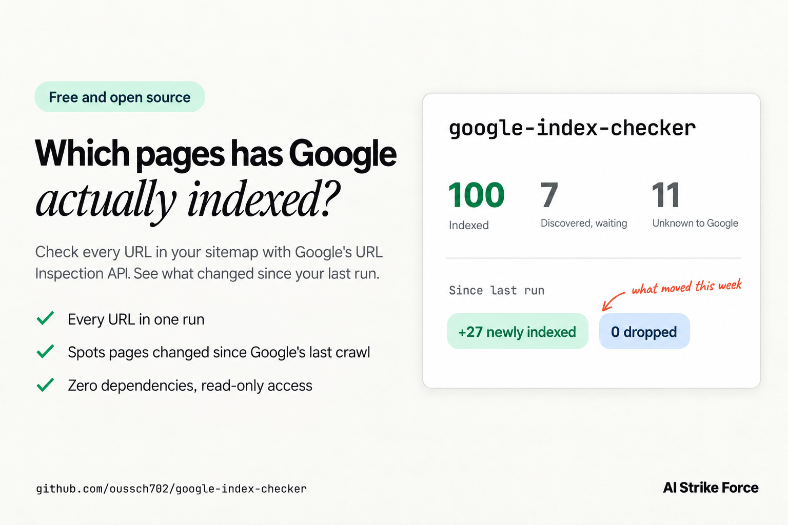

# google-index-checker

[](https://github.com/oussch702/google-index-checker/actions/workflows/test.yml)


[](LICENSE)



A bulk Google index checker. It inspects every URL in your sitemap with the official Search Console URL Inspection API, saves the result for each page, and tells you exactly what changed since the last run.

The page indexing report in Search Console is a chart. It lags, it rounds, and it never tells you which page moved. This tool gives you the live status of every single URL, so you can follow each page from discovered to indexed.

We built it to watch a new site get indexed. It showed us ten pages in "Crawled, currently not indexed" that Google indexed two days later without crawling them again. The write-up, with the method and the timestamps: [Crawled, currently not indexed: we changed nothing and Google indexed all ten](https://aistrikeforce.com/crawled-currently-not-indexed).

## Quick start

```bash
npx github:oussch702/google-index-checker \
  --site sc-domain:example.com \
  --sitemap https://example.com/sitemap.xml \
  --credentials ~/keys/search-console.json
```

You need credentials with read access to your Search Console property. Setting them up takes about ten minutes, once, and is described under [Setup](#setup).

## What it tells you

- The coverage state, verdict and last crawl time of every URL in the sitemap.
- Which pages changed after Google last crawled them. When the last crawl is older than the page's `lastmod`, Google has not judged the current version yet, and another rewrite only restarts the wait.
- Which pages Google has never crawled.
- What moved since the previous run: pages newly indexed, pages dropped from the index, and every transition between states.
- A JSON snapshot per run, and a CSV when you want a spreadsheet.

## Example report

```text
google-index-checker · sc-domain:example.com · 118 of 118 URLs inspected

Coverage
  Submitted and indexed                 100
  URL is unknown to Google               11
  Discovered - currently not indexed      7

Changed since Google last crawled them: 2
  /pricing  crawled 2026-09-17 16:14, changed 2026-09-18 15:38
  /de/beratung  crawled 2026-09-18 10:47, changed 2026-09-18 21:48
Never crawled: 18

Since 2026-09-17 18:02 UTC
  Crawled - currently not indexed -> Submitted and indexed: 10
  Discovered - currently not indexed -> Submitted and indexed: 9
  URL is unknown to Google -> Submitted and indexed: 8
  Discovered - currently not indexed -> URL is unknown to Google: 7
  URL is unknown to Google -> Discovered - currently not indexed: 5
  Newly indexed: 27   Dropped from the index: 0

Saved census/example.com/2026-09-19T20-49-43Z.json
```

## Setup

The tool needs credentials that Google accepts for your Search Console property. A service account is the simplest option.

1. In the [Google Cloud console](https://console.cloud.google.com/), choose or create a project and enable the **Google Search Console API**.
2. Under **IAM & Admin > Service accounts**, create a service account, open it and add a key in JSON format. Save the file outside your project folder.
3. In [Search Console](https://search.google.com/search-console), open your property, go to **Settings > Users and permissions** and add the service account's email address. **Restricted** permission is enough, because the tool only reads.

An `authorized_user` file from Google's application default credentials works as well, as long as its refresh token has Search Console access. That is also the route to take when your organization's policy blocks service account keys.

Keep key files out of version control. The `.gitignore` in this repository already ignores the usual names.

## Usage

Run it again a few days later and the report adds everything that changed in between. Snapshots are saved under `./census/<property>/`, one file per run.

| Option | What it does |
| --- | --- |
| `--site` | The property: `sc-domain:example.com` for a domain property, `https://example.com/` for a URL-prefix property. |
| `--sitemap` | A sitemap or sitemap index, as a URL or a local file. Gzipped files work. Repeat the option for several. |
| `--credentials` | A service account key or an `authorized_user` file. Defaults to `GOOGLE_APPLICATION_CREDENTIALS`. |
| `--out` | Folder for snapshots. Default `./census`. |
| `--limit`, `--offset` | Inspect one slice of the sitemap, for sites larger than the daily quota. |
| `--concurrency` | Inspections in parallel. Default 3. |
| `--csv` | Also write a CSV next to each snapshot. |
| `--language` | Language of Google's messages. Default `en-US`. |
| `--compare a.json b.json` | Compare two saved snapshots without calling Google. |

## Quotas

Google allows 2,000 URL inspections per property per day, and 600 per minute. To cover a larger site, run `--limit 2000` on the first day, `--limit 2000 --offset 2000` on the second, and so on, or inspect one section's sitemap at a time.

## Reading the states

The report uses Google's own wording.

| State | What it means |
| --- | --- |
| `Submitted and indexed` | The page is in Google's index. |
| `Crawled - currently not indexed` | Google fetched the page and has not decided yet. On a new site this is often a matter of time. |
| `Discovered - currently not indexed` | Google knows the URL and has not fetched it yet, usually because of how much of the site it chooses to crawl. |
| `URL is unknown to Google` | Not in the index and not in the crawl queue, whatever the sitemap says. |

One habit pays for itself: check the last crawl time before you touch a page. If Google has not crawled it since your last change, it has not judged the current version.

## FAQ

**How do I check if my pages are indexed by Google in bulk?**
Point this tool at your sitemap. It asks Google's URL Inspection API about every URL and gives you one report, instead of one Search Console lookup per page.

**Does it request indexing?**
No. Google's API only reads index status. Requesting indexing is still done in Search Console, one URL at a time.

**Is it free?**
Yes. The tool is MIT licensed, and Google does not charge for the URL Inspection API within its daily quota.

**Why not just use the page indexing report?**
The report is aggregated and delayed. The API gives the current status of each URL, including its last crawl time, which is what tells you whether Google has seen your latest change.

**Can I run it on a schedule?**
Yes. Run it daily or weekly from cron and keep the snapshot folder. Each run compares itself with the one before.

## Security

The tool talks to your sitemap URLs and to Google's APIs, and nothing else. With a service account it asks only for read-only Search Console access. It never prints keys or tokens, and snapshots hold only URLs and Google's index data.

## Contributing

Issues and pull requests are welcome. Run `npm test` before sending a change. The tests never call Google.

## License

MIT

---

Built by [AI Strike Force](https://aistrikeforce.com), an AI automation agency. We publish the tools and findings that come out of running our own site.
